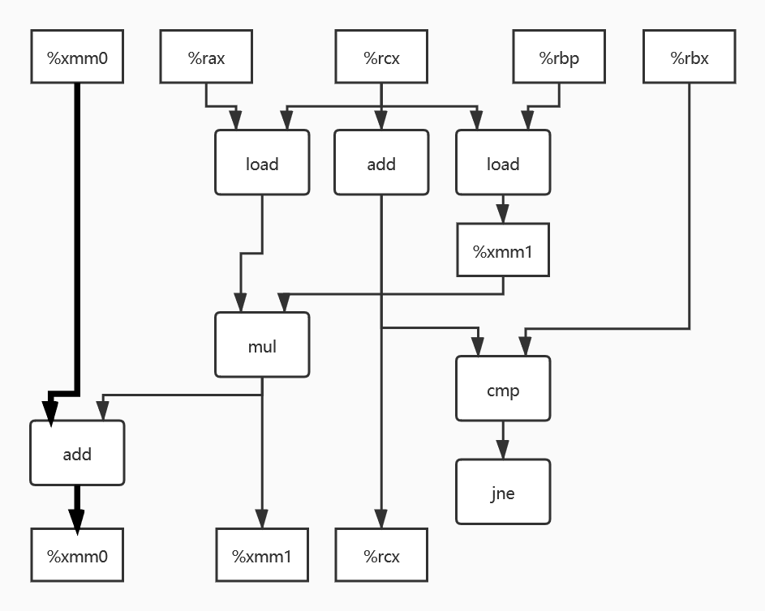
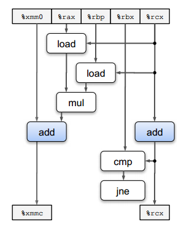

# 计算机系统  第五章作业

**学号：1190200526**

**姓名：沈城有**

**题目：5.13, 5.15, 5.17, 5.19**

---

## 5.13题

A.  


关键路径在上图中用粗线表示。

附参考答案中提供的数据流图：  


B.下界为浮点加法的延迟界限，为3.00。

C.下界为整数加法的延迟界限，为1.00。

D.虽然浮点数乘法需要5个周期，但是不存在数据依赖，即每次循环时的乘法不需要上一次乘法的结果，可以各自独立进行。但加法是依赖于上一次的结果的（累加量sum的更新），故该循环的关键路径是加法这条链。而浮点数加法的延迟为3个周期，所以CPE为3.00。

## 5.15题

代码如下：

```c
void inner6(vec_ptr u, vec_ptr v, data_t *dest)
{
    long i;
    long length = vec_length(u);
    long limit = length - 5;
    data_t *udata = get_vec_start(u);
    data_t *vdata = get_vec_start(v);
    data_t sum1 = (data_t) 0;
    data_t sum2 = (data_t) 0;
    data_t sum3 = (data_t) 0;
    data_t sum4 = (data_t) 0;
    data_t sum5 = (data_t) 0;
    data_t sum6 = (data_t) 0;
    
    /* 一次处理6个元素 */
    for(i = 0; i < limit; i += 6)
    {
        sum1 = sum1 + udata[i] * vdata[i];
        sum2 = sum2 + udata[i+1] * vdata[i+1];
        sum3 = sum3 + udata[i+2] * vdata[i+2];
        sum4 = sum4 + udata[i+3] * vdata[i+3];
        sum5 = sum5 + udata[i+4] * vdata[i+4];
        sum6 = sum6 + udata[i+5] * vdata[i+5];
    }
    
    /* 完成剩余元素 */
    for(; i < length; ++i)
    {
        sum1 = sum1 + udata[i] * vdata[i];
    }
    
    *dest = sum1 + sum2 + sum3 + sum4 + sum5 + sum6;
}
```

原因：只有两个加载单元和一个浮点数加法单元，一个时钟周期只能加载两个值并计算一次浮点数加法，CPE 最低只能到 1.00。

## 5.17题

```c
//memset的一种更有效的实现
void *align_pack_2_memset(void *s, int c, size_t n)
{
    unsigned long word = 0;  //用于存多个c
    unsigned char *schar;    //指向内存区域中下一个需填充c的位置，用于逐字节填充
    unsigned long *slong;    //指向内存区域中下一个需填充word的位置，用于批量填充
    size_t cnt = 0;          //已填充字节数
    long i;                  //循环变量
    size_t limit;            //自行添加，用于在批量填充时暂存边界，也许能优化性能
    
    /* 避免循环上界变成负数的情况 */
    if (n < 3 * sizeof(word))
        return basic_memset(s, c, n);
    
    /* 向unsigned long word中放入c的低位字节 */
    for (i = 0; i < sizeof(word); ++i)
        word = (word << 8) | (c & 0xFF);
    
    /* 逐字节写直至对齐 */
    schar = (unsigned char *) s;
    while ((unsigned long) schar % sizeof(word) != 0) {
        *schar++ = (unsigned char) c;
        ++cnt;
    }
    
    /* 一次完成2*sizeof(word)字节的填充 */
    slong = (unsigned long *) schar;
    limit = n - 2 * sizeof(word) + 1;
    while (cnt < limit) {
        *slong = word;
        *(slong + 1) = word;
        cnt += 2 * sizeof(word);
        slong += 2;
    }
    
    /* 完成剩下的几个字节（逐字节填充） */
    schar = (unsigned char *) slong;
    while (cnt < n) {
        *schar++ = (unsigned char) c;
        ++cnt;
    }
    
    return s;
}
```

注：代码主体为老师提供的答案，根据自己的理解添加了一些注释。

## 5.19题

**2次循环展开+重新结合的版本：**

```c
void psum2a(float a[], float p[], long cnt)
{
    long i;
    float last_val;  //保存p[i-1]
    last_val = p[0] = a[0];
    for (i = 1; i < cnt - 1; i += 2) {
        float a01 = a[i] + a[i+1];
        p[i] = last_val + a[i];
        p[i+1] = last_val = last_val + a01;
    }
    
    /* 完成剩余元素 */
    for (; i < cnt; i++)
        p[i] = last_val = last_val + a[i];
}
```

上述代码实现了2.00的CPE。  
由于3.00/2的延迟界限及执行三次加法以完成两个元素的计算导致的吞吐量界限使CPE无法达到1.50。

**3次循环展开+重新结合的版本：**

```c
void psum3a(float a[], float p[], long cnt)
{
    long i;
    float last_val;
    last_val = p[0] = a[0];
    for (i = 1; i < cnt - 2; i += 3) {
        p[i] = last_val + a[i];
        float a01 = a[i] + a[i+1];
        p[i+1] = last_val + a01;
        float a012 = a01 + a[i+2];
        p[i+2] = last_val = last_val + a012;
    }
    
    /* 完成剩余元素 */
    for (; i < cnt; i++)
        p[i] = last_val = last_val + a[i];
}
```

上述代码实现了1.67的CPE。  
由于执行五次加法以完成三个元素的计算导致的吞吐量界限使CPE无法继续减小。

综上，3次循环展开+重新结合是性能最好的版本。  
以更大的因子进行循环展开不会再改善CPE，因为它只会引入更多的加法运算。
